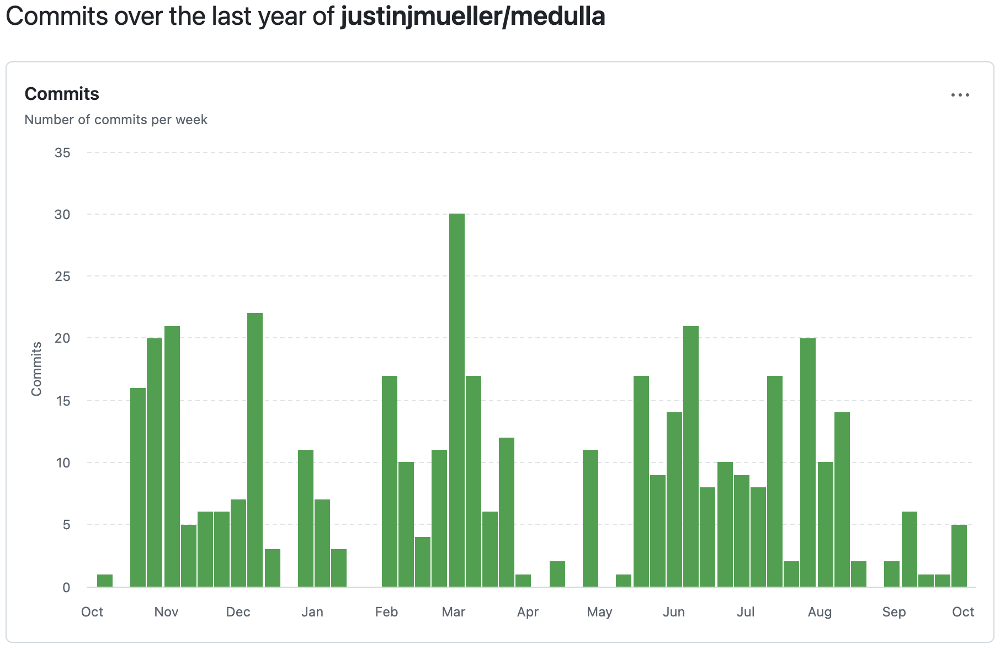

# Introduction to `medulla`
The `medulla` package is designed to be an all-encompassing tool for selection development, plotting, and systematic characterization. This tutorial focuses on the selection development aspect of `medulla`, which is intended to be a simple and flexible way to define and implement event selections for physics analyses. The core idea is to provide a straightforward way to define selections that can be easily shared, reproduced, and modified by different users.

`medulla` grew out of code originally developed for my PhD thesis analysis, and to-date has accumulated nearly 500 commits. It has active users on both SBND and ICARUS, and has seen rapid growth in the past several months. The framework has largely stabilized in terms of features.



This tutorial will reference the example configuration files located in the `tutorial/examples` directory. These files can be used as a starting point for your own selection development. The examples provided include:
* `example01_ccqe.toml` - a simple charged-current quasi-elastic (CCQE)-like selection.
* `example02_muons.toml` - a particle-level selection focusing on muons.

A slack channel in the SBN workspace (#medulla) is available for questions and discussion. Please do use it!

## Installation
The installation of `medulla` is straightforward now that a tagged version of `sbnanaobj` with SPINE products officially exists! The correct set up needs only the following commands:

```bash
# Set up the SBN software environment (choose one):
# For SBND:
source /cvmfs/sbnd.opensciencegrid.org/products/sbnd/setup_sbnd.sh

# For ICARUS:
source /cvmfs/icarus.opensciencegrid.org/products/icarus/setup_icarus.sh

# Set up the required dependencies:
setup sbnana v10_01_02_01 -q e26:prof
setup cmake v3_27_4

# Clone the medulla repository:
git clone https://github.com/justinjmueller/medulla.git medulla
cd medulla && git checkout v1.0.1
mkdir build && cd build

# Configure and build medulla:
cmake .. && make -j4
```

## The `medulla` Selection Configuration File
The configuration of an entire selection with `medulla` is controlled by TOML files. TOML (Tom's Obvious, Minimal Language) is a simple, human-readable configuration file format that has C++ and Python parsing libraries. This method of configuration is intended to be simple and straightforward to use, while still being flexible enough to accommodate a wide variety of selection needs.

All cuts and variables are implemented as simple C++ functions that consume an object (e.g. a reconstructed interaction) and return a boolean (for cuts) or a double (for branch variables). All cuts and variables are registered internally within `medulla`, and the user simply needs to specify the functions by name in the configuration file. A large foundation of pre-existing cuts and variables is provided, and users can easily add their own as needed.

### Parameter Block
Parameters can be defined once and referenced elsewhere in the TOML file. This centralizes high-level analysis details and settings and helps mitigate configuration mistakes caused by duplicated parameters. Each of the keys defined in the `parameters` block can be referenced elsewhere as `"@parameter_name"`. Note the presence of double quotes - these are necessary for the TOML library to interpret it as a string and therefore correctly substitute it with the parameter of interest.

An example `parameters` block is shown below. This `parameters` block sets up per-particle kinetic energy thresholds (MeV) that will be used later in the analysis to define particles that are "visible" in the final state.

```toml
[parameters]
photon_threshold = 25.0
electron_threshold = 25.0
muon_threshold = 143.425
pion_threshold = 25.0
proton_threshold = 50.0
```

### General Block
The `general` block contains basic configuration details relating to the analysis as a whole. It is not expected that most of these change very often. The parameters available to the user are:
* `output` - the path/name of the resulting output ROOT file (`.root` extension appended automatically).
* `primfn` - the name of the function that performs primary/secondary designation of particles. The `default_primary_classification` function takes the direct output of SPINE as the designation. This allows the user to place their own score cuts on primary classification.
* `pidfn` - the name of the function that performs PID classification of particles. The `default_pid` function takes the direct output of SPINE as the classification. This allows the user to place their own score cuts for PID (e.g., upweighting the muon softmax score to increase efficiency).
* `fsthresh` - an array of kinetic energy thresholds (MeV) for each particle type that define "visibility" criteria for particles to count towards the final state. Note: these directly reference the parameters configured in the `parameters` block above.

```toml
[general]
output = "example"
primfn = "default_primary_classification"
pidfn = "default_pid"
fsthresh = [
    "@photon_threshold",
    "@electron_threshold",
    "@muon_threshold",
    "@pion_threshold",
    "@proton_threshold",
]
```

### Sample Block
An analysis necessarily consists of datasets that the selection is run over. Each `sample` block configures an independent sample in the analysis, and is intended to decouple the sample configuration from the selection configuration. The `sample` block is defined as an entry in a list (note the double '[' in `[[sample]]`), which allows the user to define *all* samples they wish to use and run the selection (identically) on each one sequentially. The parameters available to the user are:
* `name` - a name that uniquely identifies the sample in the output ROOT file. For example, the name `simulation` will result in all selection TTrees being placed in the `events/simulation` TDirectory.
* `path` - a path or SAM definition specifying the input CAF files. A path may contain wildcards, but otherwise only supports basic pattern matching.
* `ismc` - a flag marking the file as Monte Carlo simulation. Some selections (e.g. defining signal) are only relevant for MC, so this allows a user to mark a sample accordingly.
* `disable` - an optional flag that skips the sample when running the selection. This is useful for development work. The default is false, which will not skip the sample.

```toml
[[sample]]
name = "simulation"
path = "/pnfs/sbnd/persistent/users/mueller/MCP2025B/simulation/mc5e18/input000.flat.root"
ismc = true
disable = false # Optional: default = false
```

### Tree Block
These are the most fundamentally important blocks for creating a selection. A `tree` block configures a single TTree in the output file, written in the "sbruce tree" format. The cuts used in a selection define the exact set of objects (e.g., interactions) that are represented in the tree, whereas the branch variables define the features of the object (e.g, total energy) that are extracted to populate the branches of the tree. Together, the cuts and branch variables define a complete sbruce tree.

There are many important configuration parameters here:
* `name` - the name of the sbruce tree in the output file. It will be saved as `events/<sample_name>/<tree_name>` for each configured sample (see `name` parameter above).
* `sim_only` - a boolean flag tagging the tree as only relevant for simulation (e.g., a "signal" selection using truth information).
* `mode` - defines what top-level object to loop over when applying the selection. See [tree mode section](#tree-mode-parameter) for more details.
* `add_exposure` - an optional flag that will create a separate tree with name `<tree_name>_exposure` to contain exposure information per event passing any data or spill quality cuts. This is advanced usage that is mostly relevant for studies using data.
* `cut` - the list of cuts defining the selected objects. See [dedicated cut section](#tree-cut-configuration) for more details.
* `branch` - the list of branch variables defining the branches of the tree. See [dedicated branch section](#tree-branch-configuration) for more details.

```toml
[[tree]]
name = "selected"
sim_only = false
mode = "reco"
add_exposure = true # Optional: default = false
cut = [
    ...
]
branch = [
    ...
]
```

#### Tree `mode` Parameter
The `mode` parameter defines the top-level behavior of the main selection loop. There are three options: `event`, `reco`, and `true`. Functionally, these control the application of logic within `medulla`:
* `event` - the selection will be applied at the event level with the goal of extracting event-level attributes. For example, a user may wish to extract the number of reconstructed interactions and true interactions per event:
    ```toml
    [[tree]]
    name = "eventinfo"
    sim_only = false
    mode = "event"
    cut = [
        { name = "no_cut", type = "event" },
    ]
    branch = [
        { name = "nreco",  type = "event" },
        { name = "ntrue",  type = "event" },
    ]
    ```
* `reco` - the main selection logic will be applied within a loop over reconstructed interactions within each event. This is the operating mode that most analyzers think of when they hear "selection," and is *the* main deliverable of selection development for an analysis. Branch variables with a type of `reco_particle` or `true_particle` will additionally result in a loop over particles of that respective type.
    ```toml
    [[tree]]
    name = "selected"
    sim_only = false
    mode = "reco"
    cut = [
        { name = "fiducial_cut",            type = "reco" },
        { name = "containment_cut",         type = "reco" },
        { name = "no_photons",              type = "reco",  parameters = [ "@photon_threshold"   ] },
        { name = "no_electrons",            type = "reco",  parameters = [ "@electron_threshold" ] },
        { name = "single_muon",             type = "reco",  parameters = [ "@muon_threshold"     ] },
        { name = "no_charged_pions",        type = "reco",  parameters = [ "@pion_threshold"     ] },
        { name = "single_proton",           type = "reco",  parameters = [ "@proton_threshold"   ] },
    ]
    branch = [
        { name = "neutrino_energy",       type = "mctruth" },
        { name = "baseline",              type = "mctruth" },
        { name = "cc",                    type = "mctruth" },
    ]
    ```
* `true` - the complement to the `reco` operating mode. The main selection logic will be applied within a loop over true interactions within each event. The main use-case for this mode is truth-level and signal-level studies.
    ```toml
    [[tree]]
    name = "signal"
    sim_only = true
    mode = "true"
    cut = [
        { name = "fiducial_cut",            type = "true" },
        { name = "containment_cut",         type = "true" },
        { name = "no_photons",              type = "true",  parameters = [ "@photon_threshold"   ] },
        { name = "no_electrons",            type = "true",  parameters = [ "@electron_threshold" ] },
        { name = "single_muon",             type = "true",  parameters = [ "@muon_threshold"     ] },
        { name = "no_charged_pions",        type = "true",  parameters = [ "@pion_threshold"     ] },
        { name = "single_proton",           type = "true",  parameters = [ "@proton_threshold"   ] },
    ]
    branch = [
        { name = "neutrino_energy",       type = "mctruth" },
        { name = "baseline",              type = "mctruth" },
        { name = "cc",                    type = "mctruth" },
    ]
    ```

#### Tree `cut` Configuration
Each entry in the `cut` list defines a condition on an object passing the selection. Internally, the logical "AND" of all defined cuts is taken as the final cut. Cuts can be applied at the event-level, interaction-level (reco or true), or particle-level (reco or true). The anatomy of a cut definition is as follows:

```toml
{ name = "cut_name", type = "cut_type", parameters = [ param1, param2, ... ] }
```

* `name` - the name of the cut function to apply. This needs to match exactly the name of a registered cut function in `medulla`. E.g., 
    ```c++
    /**
     * @brief Apply a containment cut on the entire interaction.
     * @details The containment cut is applied on the entire interaction. The
     * interaction is considered contained if all particles and all spacepoints
     * are contained within 5cm of the detector edges (configured in a SPINE 
     * post-processor). Additionally, no spacepoints are allowed to be
     * reconstructed in a TPC that did not create it. This is an unphysical
     * condition that can occur when a cosmic muon is moved according to an
     * assumed t0 that is very out-of-time.
     * @tparam T the type of interaction (true or reco).
     * @param obj the interaction to select on.
     * @return true if the interaction is contained.
     */
    template<class T>
    bool containment_cut(const T & obj) { return obj.is_contained; }
    REGISTER_CUT_SCOPE(RegistrationScope::Both, containment_cut, containment_cut);
    ```
* `type` - the type of object the cut is applied to. This must be one of the following options:
    * `event` - the cut is applied at the event level. Event-level cuts are defined in `event_cuts.h`. This cut is applicable for all tree modes.
    * `reco` - the cut is applied at the reconstructed interaction level. Interaction-level cuts are defined in `cuts.h`. This cut is only applicable for `reco` and `true` tree modes. If used in `true` mode, the cut will be applied to the reconstructed interaction that is matched to the true interaction (failing to find a match will result in the cut failing).
    * `true` - the cut is applied at the true interaction level. Interaction-level cuts are defined in `cuts.h`. This cut is only applicable for `reco` and `true` tree modes. If used in `reco` mode, the cut will be applied to the true interaction that is matched to the reconstructed interaction (failing to find a match will result in the cut failing).
    * `reco_particle` - the cut is applied at the reconstructed particle level. Particle-level cuts are defined in `particle_cuts.h`. This cut is only applicable for `reco` or `true` tree modes with particle-level branches. If used in `true` mode, the cut will be applied to the reconstructed particles in the reconstructed interaction that is matched to the true interaction (failing to find a match will result in the cut failing).
    * `true_particle` - the cut is applied at the true particle level. Particle-level cuts are defined in `particle_cuts.h`. This cut is only applicable for `reco` or `true` tree modes with particle-level branches. If used in `reco` mode, the cut will be applied to the true particles in the true interaction that is matched to the reconstructed interaction (failing to find a match will result in the cut failing).
* `parameters` - an optional list of parameters to pass to the cut function. This allows the user to configure cuts with different thresholds or settings without needing to define a new function for each variation. The parameters must be either a float (castable to `double`) or some reference to a parameter defined in the `parameters` block (e.g., `"@muon_threshold"`). The order of parameters must match the order expected by the cut function. See the implementation of each cut function for details.

Cuts can also be inverted by prefixing the cut name with `!`. For example, the cut definition:
```toml
{ name = "!containment_cut", type = "reco" }
```
will invert the logic of the `containment_cut` function, resulting in a cut that *fails* if the interaction is contained. All cut functions are automatically registered as variables, so if one wishes to extract the value of a cut (e.g., for efficiency studies), one can simply add a branch variable with the same name as the cut.

#### Tree `branch` Configuration

Each entry in the `branch` list defines a variable to be extracted from the selected object and stored in the output TTree. Branch variables can be applied at the event-level, interaction-level (reco or true), or particle-level (reco or true). The anatomy of a branch variable definition is as follows:

```toml
{ name = "branch_name", type = "branch_type", parameters = [ param1, param2, ... ], selector = "selector_fn" }
```

* `name` - the name of the branch variable function to apply. This needs to match exactly the name of a registered branch variable function in `medulla`. E.g.,
    ```c++
    /**
     * @brief Variable for the x-coordinate of the interaction vertex.
     * @details The interaction vertex is 3D point in space where the neutrino
     * interacted to produce the primary particles in the interaction.
     * @tparam T the type of interaction (true or reco).
     * @param obj the interaction to apply the variable on.
     * @return the x-coordinate of the interaction vertex.
     */
    template<class T>
    double vertex_x(const T & obj) { return obj.vertex[0]; }
    REGISTER_VAR_SCOPE(RegistrationScope::Both, vertex_x, vertex_x);
    ```
* `type` - the type of object the branch variable is applied to. This must be one of the following options:
  * `event` - the variable is applied at the event level. Event-level variables are defined in `event_variables.h`. 
  * `mctruth` - the variable is applied at the interaction level. Truth-level variables are defined in `mctruth.h`. These variables attach to the MCNeutrino truth object matching to the selected interaction (if no match is found, the variable will return NaN).
  * `reco` - the variable is applied at the reconstructed interaction level. Interaction-level variables are defined in `variables.h`. If used in `true` mode, the variable will be applied to the reconstructed interaction that is matched to the true interaction (failing to find a match will result in a value of NaN).
  * `true` - the variable is applied at the true interaction level. Interaction-level variables are defined in `variables.h`. If used in `reco` mode, the variable will be applied to the true interaction that is matched to the reconstructed interaction (failing to find a match will result in a value of NaN).
  * `both` - a shorthand for defining both a `reco` and `true` branch variable with the same name. This is useful for variables that have identical implementations for both reconstructed and true interactions (i.e., the vast majority) and allows the user to avoid duplicating the variable definition in the configuration file for true/reco comparison studies.
  * `reco_particle` - the variable is applied at the reconstructed particle level. Particle-level variables are defined in `particle_variables.h`. This variable is only applicable for `reco` or `true` tree modes with particle-level branches. If used in `true` mode, the variable will be applied to the reconstructed particles in the reconstructed interaction that is matched to the true interaction (failing to find a match will result in a value of NaN).
  * `true_particle` - the variable is applied at the true particle level. Particle-level variables are defined in `particle_variables.h`. This variable is only applicable for `reco` or `true` tree modes with particle-level branches. If used in `reco` mode, the variable will be applied to the true particles in the true interaction that is matched to the reconstructed interaction (failing to find a match will result in a value of NaN).
  * `both_particle` - a shorthand for defining both a `reco_particle` and `true_particle` branch variable with the same name. This is useful for variables that have identical implementations for both reconstructed and true particles (i.e., the vast majority) and allows the user to avoid duplicating the variable definition in the configuration file for true/reco comparison studies.
* `parameters` - an optional list of parameters to pass to the branch variable function. This allows the user to configure variables with different thresholds or settings without needing to define a new function for each variation. The parameters must be either a float (castable to `double`) or some reference to a parameter defined in the `parameters` block (e.g., `"@muon_threshold"`). The order of parameters must match the order expected by the variable function. See the implementation of each variable function for details.
* `selector` - an optional name of a selector function (defined in `selectors.h`). This identifies exactly one particle by index from the set of particles in the interaction, thus allowing the extraction of a single particle-level variable (e.g., the leading proton momentum) and maintaining a one-to-one correspondence with interaction-level branches. If no selector is provided, the variable will be extracted for *all* particles in the interaction. For example, the branch variable definition:
    ```toml
    { name = "p", type = "both_particle", selector = "leading_proton" },
    ```
    will extract the momentum of the leading proton in the interaction, whereas the branch variable definition:
    ```toml
    { name = "p", type = "both_particle" },
    ```
    will extract the momentum of *all* particles in the interaction.

The user has the duty to ensure that all branch variables are of the same length. Particle-level and interaction-level branches cannot be mixed in the same tree, as this will lead to a mismatch in the number of entries and a thrown exception.

### Category Block Configuration
The `category` blocks are optional sections that allow the user to define named categories for interactions at the truth level. These categories can be used to classify interactions based on specific criteria, such as interaction type or final state particle content. Each `category` block defines a single category through application of a series of cuts. The categories are assigned in order of appearance in the configuration file, with the first category that an interaction passes being assigned to that interaction. If an interaction does not pass any category, it is assigned a default category of NaN. The user is responsible for ensuring that the defined categories are mutually exclusive and collectively exhaustive.

```toml
[[category]] # 0 : Fiducial, contained, single muon, single proton
cuts = [
    { name = "neutrino"        },
    { name = "fiducial_cut"    },
    { name = "containment_cut" },
    { name = "no_photons",       parameters = [ "@photon_threshold"   ] },
    { name = "no_electrons",     parameters = [ "@electron_threshold" ] },
    { name = "no_charged_pions", parameters = [ "@pion_threshold"     ] },
    { name = "single_muon",      parameters = [ "@muon_threshold"     ] },
    { name = "single_proton",    parameters = [ "@proton_threshold"   ] },
]
```

## Running the Selection
Once the configuration file is set up, running the selection is straightforward. The `medulla` executable takes a single argument: the path to the configuration file. For example, to run the selection defined in `example01_ccqe.toml`, one would use the following command:

```bash
./selection/medulla <path_to_config>/example01_ccqe.toml
```

This will process all samples defined in the configuration file, applying the selection and producing the output ROOT file with the defined TTrees. The user will note that this initially fails due to missing tokens for accessing the input CAF files via XRootD, and that this brick wall was intentionally hit to highlight the need for proper authentication and what the failure looks like. The solution is to set up a valid XRootD token, which can be done by:

```bash
# SBND
htgettoken -a htvaultprod.fnal.gov --vaulttokenttl=1d --vaulttokenminttl=12h -i sbnd

# ICARUS
htgettoken -a htvaultprod.fnal.gov --vaulttokenttl=1d --vaulttokenminttl=12h -i icarus
```

The `--vaulttokenttl` and `--vaulttokenminttl` options define the requested lifetime of the token and the minimum time remaining on the token for regeneration purposes, respectively. The values shown here are reasonable for most users, but can be adjusted as needed. After setting up the token, the selection can be re-run and should proceed without issue.

For ICARUS users, please note that the SBND samples are enabled and the ICARUS samples are disabled! Please flip!

## Next Steps
This tutorial has provided a comprehensive overview of the `medulla` selection framework, focusing on the configuration and execution of event selections. The next steps for users interested in utilizing `medulla` for their analyses include:
* Make an event-level selection tree to extract basic event information.
* Enhance the CCQE-like selection by adding additional cuts or branch variables.
* Explore other final states by modifying the cuts and variables in the configuration file.
* Look for detector effects in the muon kinematics